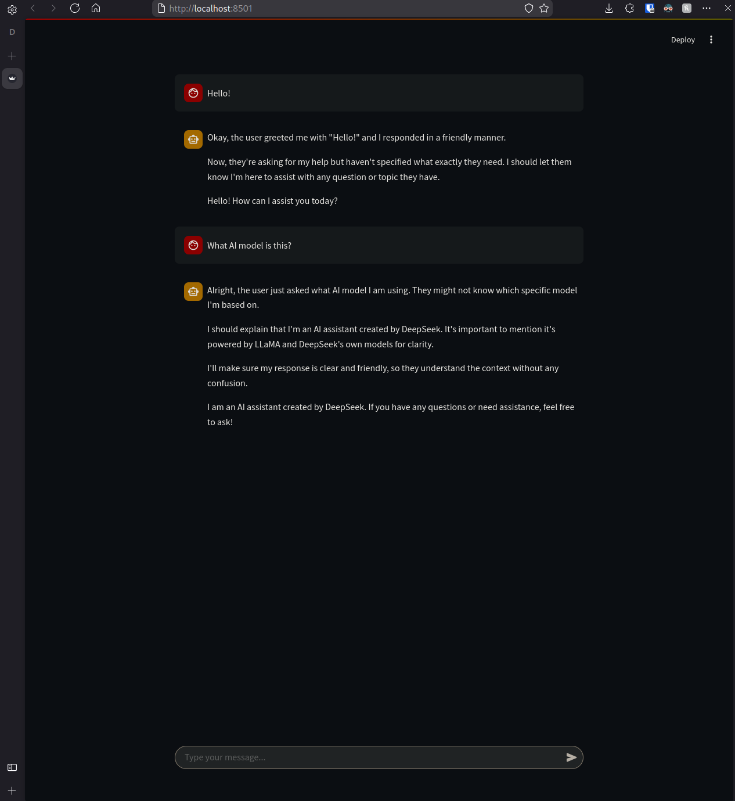

# Ollama Frontend



--- 

# Project Setup and Usage Guide
## Prerequisites
### 1. Ollama

Ollama is required for running AI models. To get started, follow these steps:

- Download and install Ollama from [here](https://ollama.com).
- Once installed, pull the desired model (e.g., deepseek-r1) by running the following command:

```bash
ollama pull deepseek-r1
```

### 2. Python and Required Libraries

Ensure you have Python installed, then set up a virtual environment to manage dependencies:

- Create a Virtual Environment:

python -m venv venv

- Activate the Virtual Environment:

    - On Linux/MacOS:

```bash
source venv/bin/activate
```

- On Windows:

```bash
    .\venv\Scripts\activate
```

- Install Dependencies:

```bash
pip install -r requirements.txt
```

## Running the Application
### 1. Start Ollama Server

To start the Ollama server, run the following command:

```bash
ollama serve
```

### 2. Run the Streamlit Application

To launch the application, use the following command, specifying the AI model:

```bash
streamlit run main.py --ai-model <model-name>
```
For example:

```bash
streamlit run main.py --ai-model deepseek-r1
```

